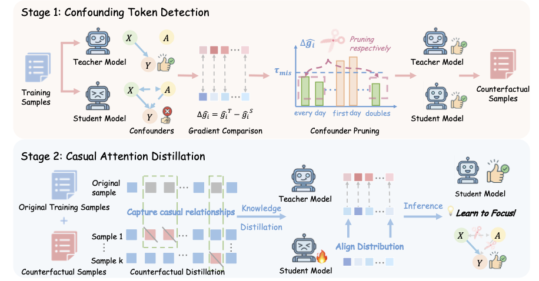

# Learning to Focus: Causal Attention Distillation via Gradient-Guided Token Pruning

[](https://arxiv.org/abs/2506.07851)

Code&Data for the paper **Learning to Focus: Causal Attention Distillation via Gradient-Guided Token Pruning [NeurIPS 2025]**. We propose **Learning to Focus (LeaF)**, a two-stage framework that treats distracting patterns as spurious confounders in LLM reasoning.

1. **Confounding Token Detection**  
   LeaF identifies **confounding tokens** through gradient-based comparisons between a high-capacity teacher and a student model. 
   
   Then, it **generates counterfactual samples** by span pruning, removing contiguous spans of the detected confounding tokens from each instruction.  
2. **Causal Attention Distillation**  
   LeaF introduces **a hybrid distillation loss** that minimizes two KL divergences: one for original sample (standard distillation) and one for counterfactual sample (counterfactual distillation). 

<div style="display: flex; justify-content: center; flex-wrap: wrap;">
    
</div>

---------
## News
- [2025.10.24] We update the camera-ready version [arxiv](https://arxiv.org/pdf/2506.07851) and add LeaF experiments on multi-hop QA tasks.
- [2025.09.28] Our paper is accepted to NeurIPS 2025.
- [2025.08.04] We upload the code for confounding token detection and causal attention distillation.
- [2025.06.09] We release our paper on [arxiv](https://arxiv.org/pdf/2506.07851).
  

## Evaluation Results

| Model                             | GSM8K   | MATH    | Olympiad-Bench | MathBench Avg. | Human-Eval+ | Leet-Code | Livecode-Bench | CodeBench Avg. |
|-----------------------------------|--------:|--------:|---------------:|---------------:|------------:|----------:|---------------:|---------------:|
| *Teacher Model*                   |         |         |                |                |             |           |                |                |
| LLaMA3.3-70B-Instruct             |   95.60 |   70.40 |          36.50 |          67.50 |       78.05 |     53.90 |          45.02 |          58.99 |
| Qwen2.5-72B-Instruct              |   95.45 |   73.80 |          41.25 |          70.17 |       81.71 |     69.40 |          54.42 |          68.51 |
| *LLaMA3.2-1B-Instruct*            |         |         |                |                |             |           |                |                |
| Instruct Model (Pre-KD)           |   44.88 |   24.20 |           5.79 |          24.96 |       29.27 |   **7.22** |           9.68 |          15.39 |
| KD w/o Mask                       |   56.79 |   33.40 |           8.90 |          33.03 |       32.32 |     6.11 |       **13.74** |          17.39 |
| LeaF (Instr Mask)                 | <u>57.70</u> | **35.40** |    **10.09** | <u>34.40</u> |       39.02 | <u>6.67</u> |     <u>13.60</u> |    <u>19.76</u> |
| LeaF (Instr & Resp Mask)          | **58.98** | <u>35.20</u> | <u>9.94</u> | **34.71** | **39.63** | **7.22** |        12.48 |    **19.77** |
| *LLaMA3.2-3B-Instruct*            |         |         |                |                |             |           |                |                |
| Instruct Model (Pre-KD)           |   76.88 |   42.80 |          13.20 |          44.29 |       48.78 |     13.89 |          20.34 |          27.67 |
| KD w/o Mask                       |   82.87 |   49.00 |          18.99 |          50.29 |       54.88 |     16.67 |          24.12 |          31.89 |
| LeaF (Instr Mask)                 | <u>83.09</u> | <u>51.80</u> |   <u>20.77</u> | <u>51.88</u> |       55.49 | <u>19.44</u> |  <u>25.39</u> |  <u>33.44</u> |
| LeaF (Instr & Resp Mask)          | **84.69** | **52.40** | **22.55** | **53.21** | <u>56.10</u> | **21.67** | **25.81** | **34.53** |
| *Qwen2.5-Math-1.5B*               |         |         |                |                |             |           |                |                |
| Base Model (Pre-KD)               |   65.20 |   41.40 |          21.96 |          42.85 |       35.37 |      6.67 |           1.26 |          14.43 |
| KD w/o Mask                       |   82.18 |   67.80 |          31.16 |          60.38 |       41.46 | <u>7.78</u> |          10.10 |          19.78 |
| LeaF (Instr Mask)                 |   84.69 | <u>68.60</u> | **32.79** | <u>62.03</u> |       42.68 | **9.94** |   <u>10.80</u> |   <u>20.97</u> |
| LeaF (Instr & Resp Mask)          | **85.29** | **70.60** | <u>31.75</u> | **62.54** | <u>43.29</u> | **9.94** |  **13.04** | **21.92** |


## Installation

```bash
pip install -r requirements.txt
```

## Repository Structure

```text
## 项目目录结构

Code_for_LeaF/
├── data
│   ├── llama_1b_instruct_level
│   │   └── Distill_NuminaMATH_llama_1b_misleading_0.10.json
│   ├── llama_1b_response_level
│   │   └── Distill_NuminaMath_llama_1b_misleading_step_0.075.json
│   └── llama_1b_gradient_data
│       └── Numina_train_data_llama_1b_1.2w.json
├── scripts
│   ├── Confounding_token_detection
│   │   ├── gradient_comparison
│   │   │   ├── run_instruct_level_llama.sh
│   │   │   └── run_instruct_level_qwen.sh
│   │   └── remove_confounding_tokens
│   │       ├── run_code.sh
│   │       └── run_math.sh
│   └── Causal_attention_distillation
│       ├── instruct_level_distillation
│       │   ├── run_llama3.2_1b_instruct.sh
│       │   ├── run_llama3.2_3b_instruct.sh
│       │   └── run_qwen2.5_1.5b_math.sh
│       └── response_level_distillation
│           ├── run_llama3.2_1b_response.sh
│           ├── run_llama3.2_3b_response.sh
│           └── run_qwen2.5_1.5b_response.sh
├── src
│   ├── Causal_attention_distillation
│   │   ├── LeaF_instruct_level
│   │   │   └── distill_instruct_level.py
│   │   └── LeaF_response_level
│   │       └── distill_response_level.py
│   └── Confounding_token_detection
│       ├── run_gradients_llama_instruct_level.py
│       ├── run_gradients_llama_response_level.py
│       ├── run_gradients_qwen_instruct_level.py
│       ├── run_gradients_qwen_response_level.py
│       ├── remove_confounding_tokens_code.py
│       └── remove_confounding_tokens_math.py
├── requirements.txt
└── README.md


```

## Usage

### 1. Gradient-Based Comparison

Perform gradient-based misleading token detection.

- **Instruction-Level**  
    ```
    bash scripts/Confounding_token_detection/gradient_comparison/run_instruct_level_llama.sh  
    bash scripts/Confounding_token_detection/gradient_comparison/run_instruct_level_qwen.sh
    ```

- **Response-Level**  
    ```
    bash scripts/Confounding_token_detection/gradient_comparison/run_response_level_llama.sh  
    bash scripts/Confounding_token_detection/gradient_comparison/run_response_level_qwen.sh
    ```

### 2. Remove Confounding Tokens

Prune identified confounders in the training corpus.

- **Code Corpus**  
    ```
    bash scripts/Confounding_token_detection/remove_confounding_tokens/run_code.sh
    ```

- **Math Corpus**  
    ```
    bash scripts/Confounding_token_detection/remove_confounding_tokens/run_math.sh
    ```

### 3. Causal Attention Distillation

Align student attention to teacher attention.

- **Instruction-Level Distillation**  
    ```
    bash scripts/Causal_attention_distillation/instruct_level_distillation/run_llama3.2_1b_instruct.sh  
    bash scripts/Causal_attention_distillation/instruct_level_distillation/run_llama3.2_3b_instruct.sh  
    bash scripts/Causal_attention_distillation/instruct_level_distillation/run_qwen2.5_1.5b_response.sh
    ```

- **Instruction + Response-Level Distillation**  
    ```
    bash scripts/Causal_attention_distillation/response_level_distillation/run_llama3.2_1b_response.sh  
    bash scripts/Causal_attention_distillation/response_level_distillation/run_llama3.2_3b_response.sh  
    bash scripts/Causal_attention_distillation/response_level_distillation/run_qwen2.5_1.5b_response.sh
    ```


## Acknowledgments
Our code is mainly based on [alpaca-lora](https://github.com/tloen/alpaca-lora), [AceCoder](https://github.com/TIGER-AI-Lab/AceCoder), and [Step-DPO](https://github.com/dvlab-research/Step-DPO). We sincerely thank them for their open-sourcing!

## Citation
If you find our work helpful, please kindly cite as
```bibtex
@article{guo2025learning,
  title={Learning to Focus: Causal Attention Distillation via Gradient-Guided Token Pruning},
  author={Guo, Yiju and Yang, Wenkai and Sun, Zexu and Ding, Ning and Liu, Zhiyuan and Lin, Yankai},
  journal={arXiv preprint arXiv:2506.07851},
  year={2025}
}
```
